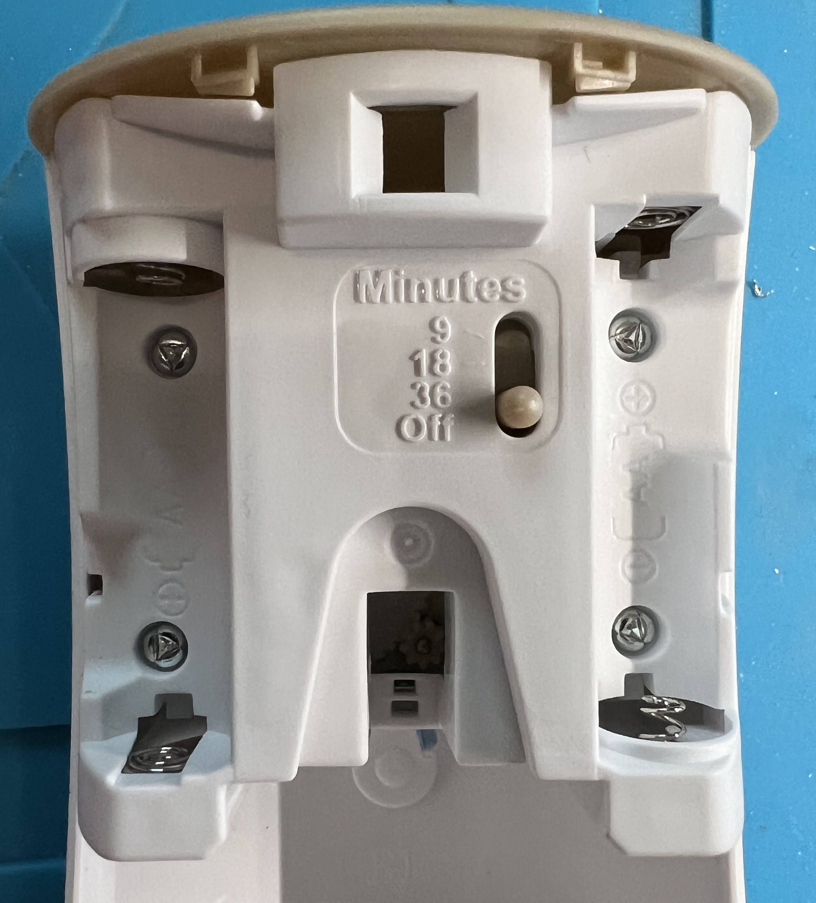
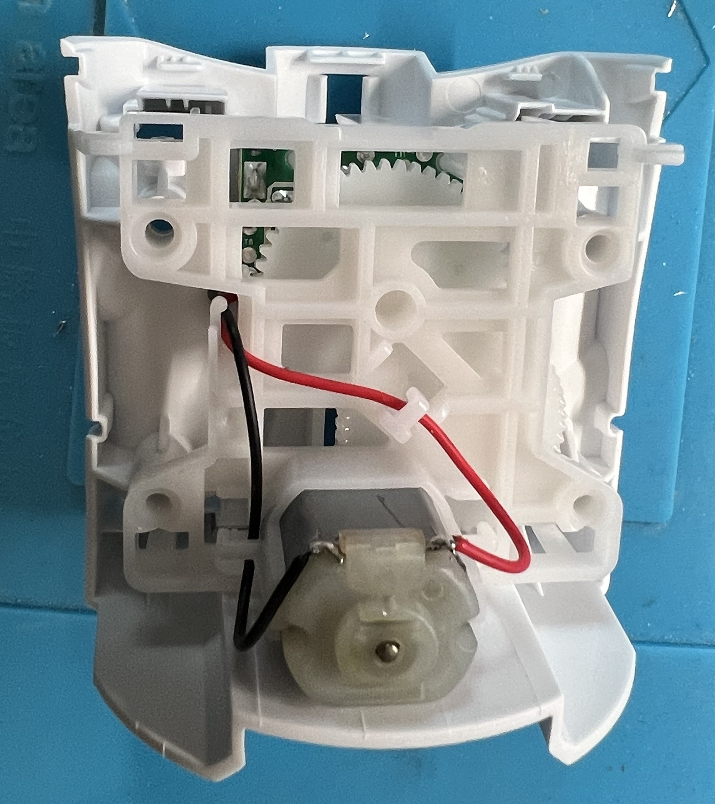
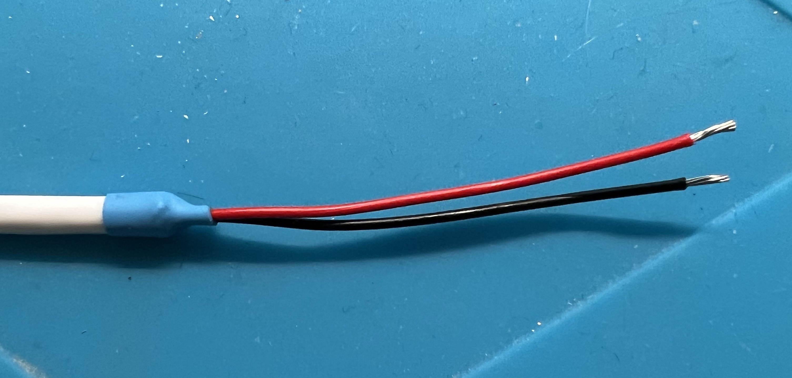
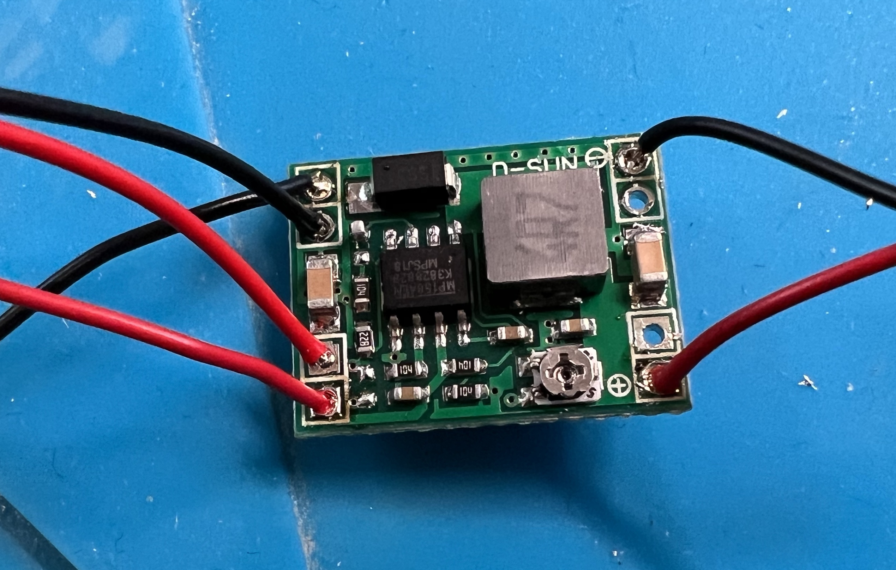
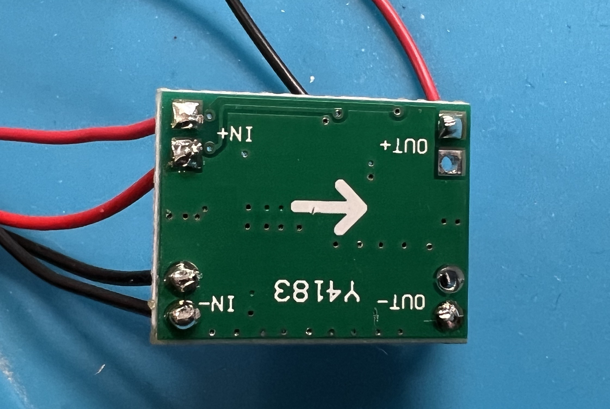
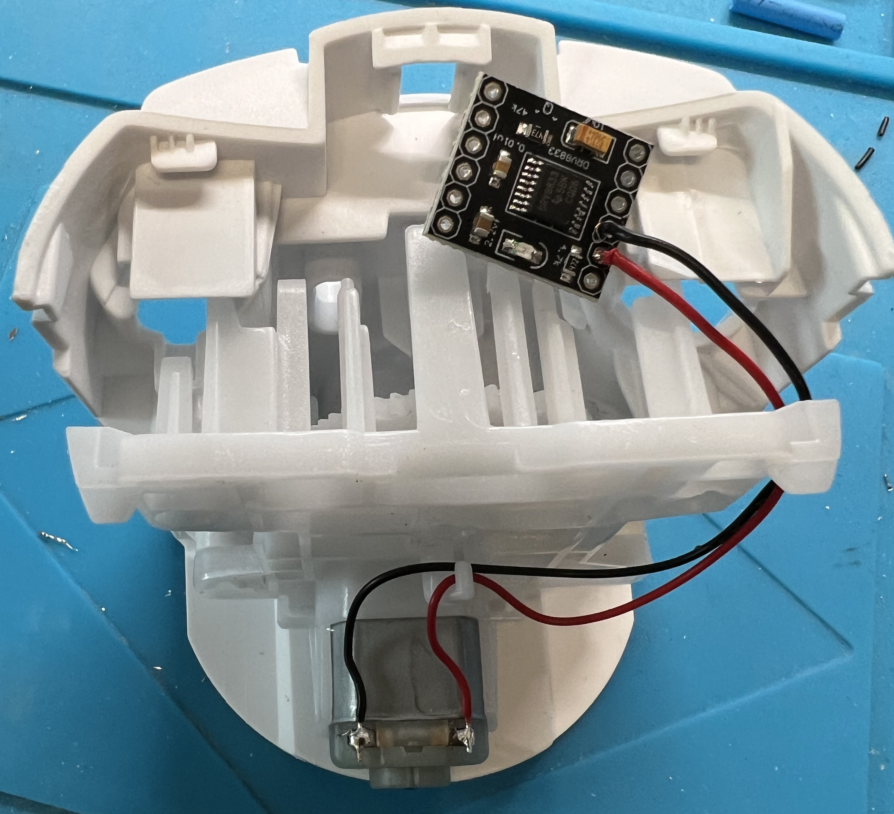
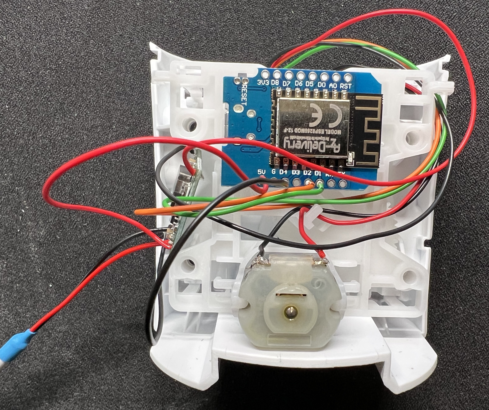
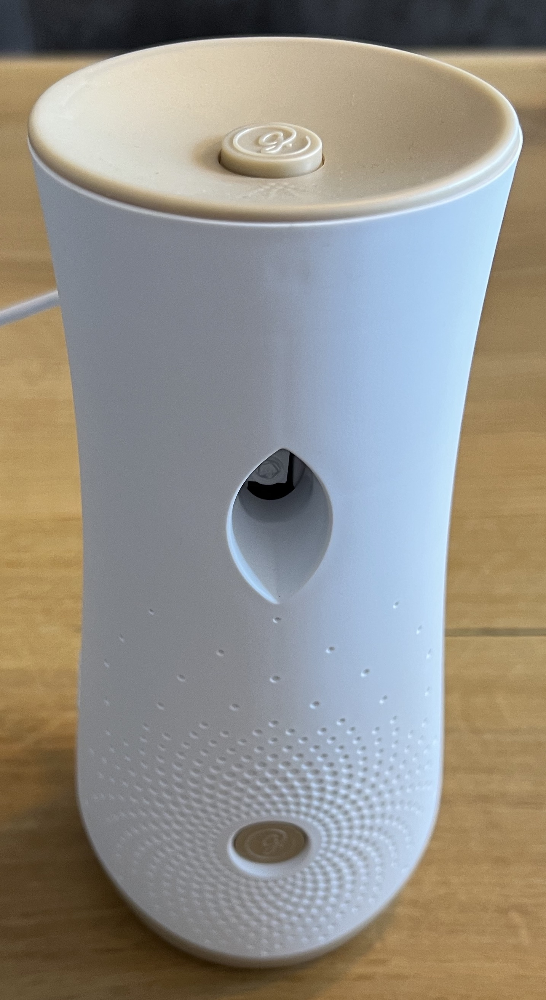
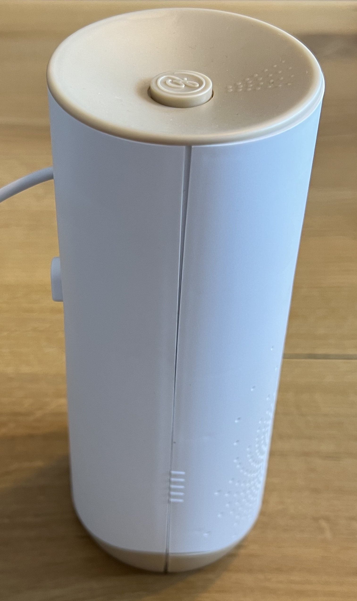
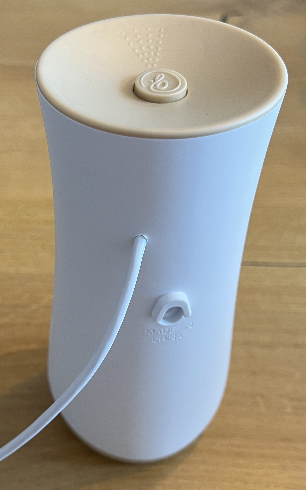

# Glade Airfreshener

## Intruduction

### Why not using the airfreshener out of the box with time schedule?

Our guest restroom is not used as frequently that a maximum spray interval of 36 minutes makes sense.
When adding a ESP8266 we can control the frequency and need to spray by [home assistant](https://www.home-assistant.io/).
For example we can use later a reed contact for windows and doors behind the toilet flush button to detect the "need" to freshen the air ;-).

### Why not using the Airwick freshmatic max?

The device is not assembled with screws.
I have ordered three of them but only one was using screws.
All of my Glade automatic had screws in it which makes the disassembly and reassembly much easier even if they use a rectangular screw hat.

## Needed parts

* Glade automatic airfreshener (e.g. [Relaxing Zen Bundle](https://amzn.to/3IKhxcI))
* ESP8266 without presoldered pin headers (e.g. [AZ-Delivery D1 Mini NodeMCU 5-pack](https://amzn.to/3CH0Kn1))
* DC/DC-StepDown Buck converter (e.g. [Senbeeda 6-pack MP1584EN](https://amzn.to/3ZGIF2i))
* Motor H-Bridge driver DRV8833 (e.g. [Fasizi 5-pack DRV8833](https://amzn.to/3XckQxK))
* USB cable for 5V power supply
* Optional, but recommended:
  * Heat shrink tube

**Approx project cost per air freshener with products selected above:** 11,50 EUR (or 7 EUR without airfreshener)

## Needed tools

* Screwdriver with rectangular bit 2.2 mm
* Soldering iron
* Wires (preferred in different colors) (e.g. [10-pack of wires](https://amzn.to/3QxKqKK))
* Drill bit which matches the diameter of the USB cable

## How does it work:

* A DC Motor is used to push down the top of the can in the device.
* Glade is moving the motor in both directions

## Lets build it

* USB cable -> Step down
  * red -> IN+ (red wire)
  * black -> IN- (black wire)
* Step down -> DRV8833
  * OUT+ -> VCC (red wire)
  * OUT- -> GND (black wire)
* Step down -> ESP8266
  * second IN+ -> 5V (red wire)
  * second IN- -> GND (black wire)
* ESP8266 -> DRV8833
  * D1 -> IN1 (green wire)
  * D2 -> IN2 (orange wire)
* DRV8833 -> DC-Motor
  * OUT1 -> red wire side
  * OUT2 -> black wire side

At rear of DRV8833 there is Jumper J2, bridge that if not already bridged.

Adjust the DC/DC buck converter to output 3V.

After flashing the ESP8266 please test if the movement direction is correct.
If it is not, change the GPIO pins at forward and reverse pin.
Forward means pushing, reverse means moving back to start position.
Yoy can also adjust the timing if needed. For me it works totally fine.

## ESPHome YAML

The YAML is now moved to its [own file](airfreshener.yaml).

## Version History

* 2022-01-22
  * Added spray counter as readonly data
  * Added reset button to set spraycounter back to 0
  * Changed timings for glade cans (previously worked fine for airwick cans but not glade cans)
  * Spraying logic moved to a script
  * Avoiding multiple script executions by the button which avoids motor stress.
  * Moved ESPHome YAMl to its own file
* 2022-01-12
  * First version of airfreshener project

## Assembly Pictures

